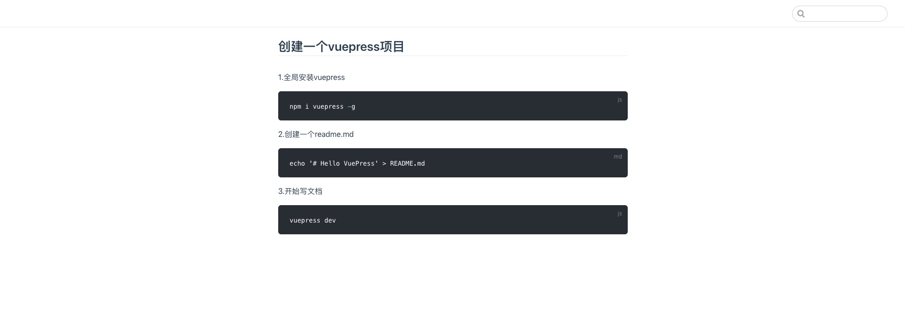
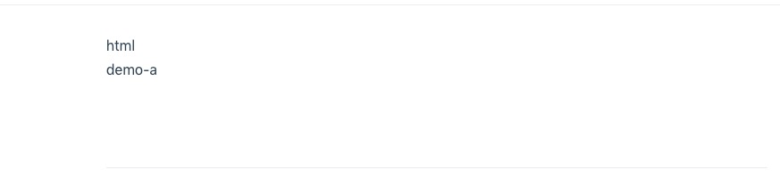

### 创建一个vuepress项目

1.全局安装vuepress
```js
npm i vuepress -g
```
2.创建一个readme.md

```md
echo '# Hello VuePress' > README.md
```
3.开始写文档
```js
vuepress dev
```
运行起来后长这样子的

### 创建配置文件
默认是没有任何配置文件的比如header，和sideNav都是没有的
1.首先创建一个.vuepress的目录

    mkdir .vuepress
2.在.vuepress目录下新建一个config.js  
3.配置主题-导航链接
    
    所有的主题配置都在config.js中配置
```js
module.exports = {
    themeConfig: {
        nav: [
          { text: 'Web', link: '/' },
          { text: 'App', link: '/guide/' },
          { text: 'Github', link: 'https://github.com/' },
        ]
      }
}
```
nav负责配置头部导航

4.配置主题-侧边导航

4.1 一般配置
```js
sidebar: [
    ['web/html', 'HTML'],
    ['web/css', 'CSS']
]
```
sidebar 负责配置侧边导航，形式是[link, text]的形式

4.2 侧边栏组(sidebar groups)

    sidebar: [
        {
            title: 'Web',
            collapsable: false,
            children: [
                ['web/html', 'HTML'],
                ['web/css', 'CSS']
            ]
        }
    ]

4.3 多侧边栏
如果你希望为不同的页面组显示不同的侧边栏，请先将页面组织到目录中：


    ├─ README.md
    ├─ web
    │  ├─ html.md
    │  ├─ css.md
    │  └─ js.md
    └─ app
       ├─ header.md
       ├─ nav.md
       └─ content.md
     sidebar: {
        '/web/': [['html', 'HTML'], ['css', 'CSC']]
    }


### 现在基本的配置已经完成

#### 配置主页
默认主题提供了一个主页布局（用于该网站的主页）。要使用它，需要在你的根目录 README.md 的 YAML front matter 中指定 home：true 加上一些其他元数据。这是本网站使用的实际数据：
```md{4}
---
home: true
actionText: Get Started →
actionLink: /web/html
features:
- title: Simplicity First
  details: Minimal setup with markdown-centered project structure helps you focus on writing.
- title: Vue-Powered
  details: Enjoy the dev experience of Vue + webpack, use Vue components in markdown, and develop custom themes with Vue.
- title: Performant
  details: VuePress generates pre-rendered static HTML for each page, and runs as an SPA once a page is loaded.
footer: Vuepress 采坑记录
---
```

#### 编写vue组件
1.在.vuepress下创建components目录

```md
.vuepress / components 中的任意 * .vue 文件都会自动注册为全局的异步组件:

<template>
    <div class="">
        demo-a
    </div>
</template>
```


#### 使用组件
1.例如在html.md中使用demo-a组件：

    <demo-a/>
如下图

使用起来非常的方便

#### 自定义主题
1.在.vuepress下创建theme目录，再创建LayOut.vue就可以自定义主题；
2.还可以动过vuepress eject dirname的方式直接下载默认主题的样式，在此基础上自行修改


#### 部署
